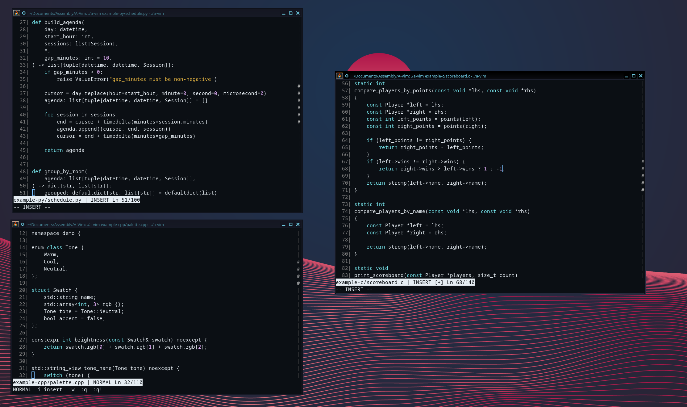

# A-Vim

Minimal vim-like text editor in pure x86_64 Linux assembly.



## Overview

A-Vim is a small modal text editor built directly on Linux syscalls and ANSI terminal control.
It is intentionally compact, fast to build, and focused on practical editing rather than feature bloat.

## Highlights

- pure x86_64 Linux assembly
- normal, insert, and command modes
- open existing files or start empty
- save with `:w`, save-and-quit with `:wq`
- quit safely with `:q` or force quit with `:q!`
- syntax coloring for C-like, assembly, and hash-comment file types
- right-side vertical position indicator
- cursor-mode styling for normal vs insert behavior
- smoke-tested editing, saving, cursor behavior, scrolling, and syntax rendering

## Supported syntax groups

- C-like: `.c`, `.h`, `.cpp`, `.hpp`, `.cc`, `.js`, `.ts`, `.java`, `.go`, `.rs`
- Assembly: `.asm`, `.s`, `.S`
- Hash-comment: `.py`, `.sh`, `.rb`, `.pl`, `.yaml`, `.yml`, `.toml`, `.ini`, `.conf`

## Build

```sh
make
```

Clean and rebuild:

```sh
make rebuild
```

## Run

```sh
./a-vim path/to/file
```

Run without a file to start with an empty buffer.

## Controls

### Normal mode

- `i` — enter insert mode
- `:` — enter command mode
- `h j k l` or arrow keys — move
- `x` — delete character under cursor
- `Home` / `End` / `PageUp` / `PageDown`

### Insert mode

- type text directly
- `Enter` — insert newline
- `Backspace` — delete left
- `Delete` — delete under cursor
- `Esc` — return to normal mode

### Command mode

- `:w` — save
- `:w filename` — save as
- `:wq` — save and quit
- `:q` — quit if clean
- `:q!` — quit without saving
- `Esc` — cancel command mode

## Examples

- `example-c/scoreboard.c`
- `example-cpp/palette.cpp`
- `example-asm/hello.asm`
- `example-py/schedule.py`

## Test

```sh
make test
```

## Current limits

- up to 8192 lines
- up to 1024 bytes per line
- fixed in-memory line buffer model

## Notes

- optimized for interactive terminal use
- large files beyond editor limits are truncated with a warning
- designed for practical assembly-first editing, not full Vim compatibility

## Author

- [@GuestAUser](https://github.com/GuestAUser)
